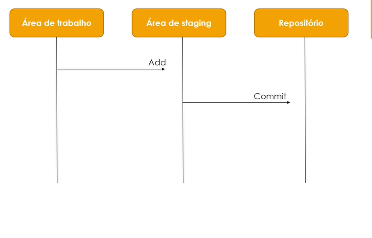

### Seção 2

#### Primeiro commit

```
$ echo "hello world" > hello.txt

$ git add hello.txt #ou
$ git add .

$ git commit -m "Creating hello.txt"

$ git hist

$ git log
```

* Área de staging ou área de preparo (Contém todas os arquivos e alterações que serão considerados no commit)



---

#### Git Show

* Para visualizar as alterações em um determinado commit, pode ser utilizado o comando git show.

´´´
$ git show

$ git show <commit(hash N)...<commit(hash)M> #mostrar #alterações de um conjunto de commits
´´´

#### Git push

* Empurrando notificações para o servidor remoto

```
$ git push
#msg de erro = Branch master local ainda não possui uma #branch de rastreamento.

$ git push --set-upstream origin master

```

#### Git ids

* Git id é o nome de um objeto git
* No primeiro commit é gerado uma string de 40 caracteres que é o identificador desse commit.
* O comando 'git log' mostrará essa string de 40c. Essa string é o nome de um objeto de commit (contido em .git/objects)
* No 'git hist' aparece os primeiros 7 caracteres.


```
$ git log

$ git hist
```

#### Git objects

* Dentro de um repositório raiz do git podemos ter arquivos e diretórios. Diretórios que geralmente contém outros diretórios.
* No git o conteúdo dos arquivos são armazenados em objetos chamados **Blobs**.
* Diretórios são equivalentes a uma árvore.(**tree**)
   -> Uma árvore é basicamente uma lista de diretórios referindo-se a blobs, bem como a outras árvores.
* Um commit é uma imagem (snapshot) desse sistema de arquivos em um determinado momento.

```
$ git hist

$ git cat-file -t <hash do primeiro commit>
$ git cat-file -p <hash do primeiro commit>
# identificador da árvore

$ git cat-file -t <hash da árvore>
$ git cat-file -p <hash da árvore>
#aparece o identificador do blob

$ git cat-file -t <hash do blob>
$ git cat-file -p <hash do blob>
# o que contém no arquivo

```


```
$ mkdir docs
$ cd  docs
$ echo "orientacoes" > orientacoes.txt
$ echo "pendencias" > pendencias.txt
$ git add .
$ git commit -m "creating docs"
```

