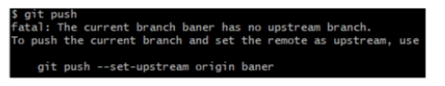

### **Seção 3**
___
<br>

### Branches

<br>

<br>

* Uma branch é uma ramificação de um projeto.
* Em git, uma branch é um ponteiro para um commit.
* O Conteúdo do arquivo master em \.gif\refs\heads possui uma hash e essa hash é exatamente a hash do último commit até o momento.

```
$cat .git/refs/heads/main
```

Benefícios no git

-> Rápido e fácil de ser criada. <br>
-> Os membros da equipe podem isolar seu trabalho para que ele não afete os outros até que esteja pronto.<br>
-> As ramificações permitem suporte a várias versões do projeto simultaneamente.<br>
-> As ramificações permitem facilmente incluir processos de revisão de arquivos.<br>

### HEAD

* A HEAD no git representa a versão que você está trabalhando no momento.
* Através da HEAD que sabemos em qual branch estamos trabalhando.

```
$ git hist

$ cat .git/head

$ cat .git/refs/heads/main
```

<br>

### Checkout

* Utilizado principalmente para alternar entre versões.
```
git checkout |<referência> | <commit>
```
* É possível utilizar referências com a opção ~n, sendo **n** um inteiro qualquer. Ex:
```
git checkout <branch>~n 
# alterna para o penúltimo commit da branch em questão.
```

```
git checkout -b <new branch>

# Cria uma nova branch e alterna para a mesma.
```

### Criando uma branch

```
git checkout -b baner

git branch -a
```

git branch -a -> Você irá visualizar as branchs de rastreamento em 
<font color="red"> vermelho </font>
, branchs locais em 
<font color="white"> branco </font>
e o <font color="green"> * em verde</font> indica a branch corrente.

* A branch *baner* foi criada mas ainda não existe uma de rastreamento correspondente.

```
$ touch banner.txt
$ git add banner.txt
$ git commit -m "adding banner.txt"
$ git push
```

<br>

-> Isso aconteceu pois não há uma branch de rastreamento que esteja rastreando nossa branch local.<br>
-> Logo, para a primeira vez será necessário executar o push conforme abaixo. <br>

```
$ git push --set-upstream origin baner
# ou

$ git push -u origin baner
$ git branch -a

$ git remote get-url origin
```
-> Note que a branch *banner* de rastreamento foi criada e já está rastreando *baner* local.

* Outras formas de criar uma branch

```     
git checkout -b <nome da branch>
```
Esse comando cria uma nova branch e altera a referência HEAD para a mesma, tornando-a a branch corrente.

```
git branch <nome da branch>
```
-> Cria uma nova branch a partir da branch **corrente**.

```
git branch <nome da branch específica> <nome da nova branch>
```
->Cria uma nova branch a partir de uma branch **específica**.